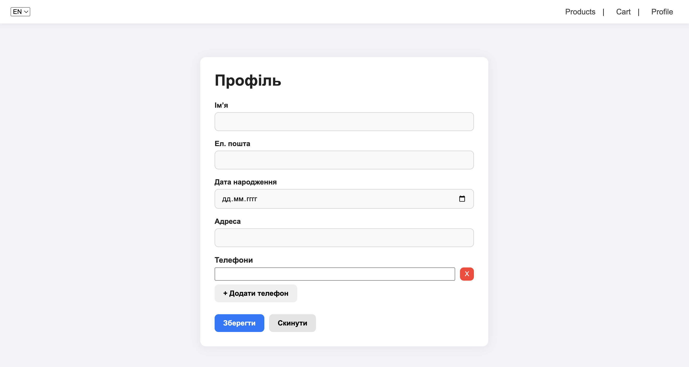

 # Лабораторна робота 4
## Тема: Управління станом (Pinia), локалізація (vue-i18n) та валідація форм (VeeValidate) у Vue 3

### Кроки запуску проєкту

```bash
npm install
npm run dev
Відкрити у браузері:
http://localhost:5173
```
Повноцінний демонстраційний проєкт інтернет-магазину на Vue 3 + Vite, з використанням:

- Pinia (stores, persistedstate)
- i18n (локалізація + синхронізація налаштувань)
- VeeValidate + Yup/Zod (валідація форм)
- Vue Router
- Акуратного UI на чистому CSS

### **Pinia**
- **createPinia** — ініціалізація Pinia у `main.js`.
- **defineStore** — створення сторів у директорії `src/stores/`:
  - `useCartStore.js`
  - `useProductsStore.js`
  - `useSettingsStore.js`
  - `useProfileStore.js`
- **storeToRefs** — використано в компонентах:
  - `CartPage.vue` — для реактивного доступу до товарів у кошику.
  - `ProfilePage.vue` — для доступу до профільних даних.
  - `Header.vue` — для доступу до локалі та налаштувань.
- **persistedstate** — локальне збереження сторів у `localStorage`:
  - `useSettingsStore`: використано `pick` для збереження лише `locale`.
  - `useCartStore`: використано кастомний ключ `cart-storage-key`.
  - `useProfileStore`: використано `omit`, щоб не зберігати службові поля.

---

### **i18n**
- **createI18n** — ініціалізація у `src/plugins/i18n.js`.
- **messages** — файли перекладів у `src/locales/ua.json` та `src/locales/en.json`.
- **кастомний модифікатор** — додано формат `uppercase`, використовується у шаблонах:
  ```html
  {{ $t('profile.name') | uppercase }}
  ```
- **синхронізація з settings.locale** —
  - у `settingsStore` зберігається `locale`.
  - у `main.js` спостерігач встановлює `i18n.global.locale = settings.locale`.
  - після зміни мови UI оновлюється автоматично.

---

### **VeeValidate**
- **configure()** — глобальна конфігурація у `src/plugins/validation.js`.
- **useForm** — у `ProfilePage.vue` для керування формою редагування профілю.
- **useField** — використовується для кожного інпута профілю (імʼя, email, phone).
- **useFieldArray** — використано у формі адрес (масив адрес користувача).
- **validationSchema (Yup/Zod)** — схема у `profileValidation.js`:
  - валідація email
  - мінімальна довжина імені
  - валідація номера телефону
- **setFieldError** — використано при помилці серверу:
  ```js
  setFieldError('email', t('errors.emailExists'));
  ```

  # Скріни
  
 
 
