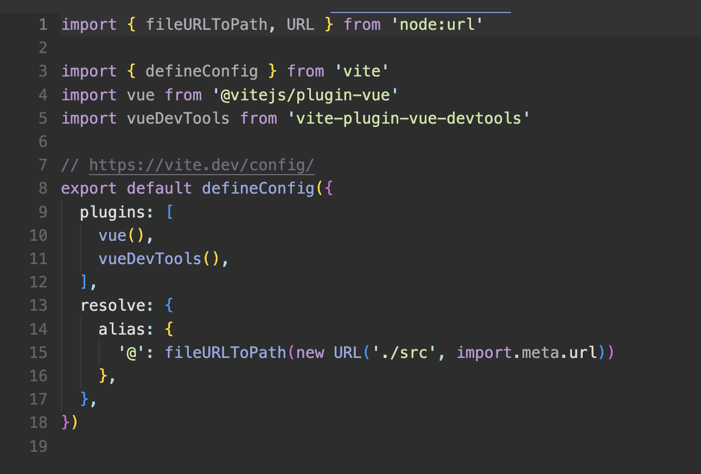
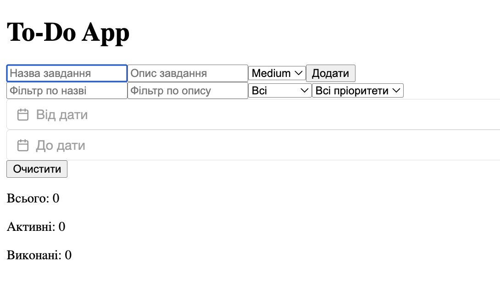
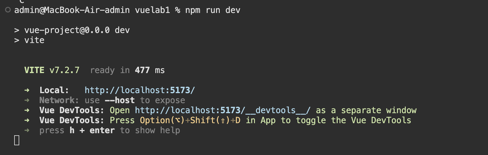

# Лабораторна робота №1  
## Тема: Знайомство з Vue.js 3 (Composition API)

### Кроки запуску проєкту:
#### npm create vue@latest
#### npm install
#### npm install @vuepic/vue-datepicker
#### npm run dev
#### Відкрити у браузері: http://localhost:5173

## Використання ref та reactive
```js
const count = ref(0)
const state = reactive({
  items: []
})
```

## computed
```js
const total = computed(() => state.items.length)
```

## watch
```js
watch(() => state.items, (newVal) => {
  localStorage.setItem('items', JSON.stringify(newVal))
}, { deep: true })
```

## Використані директиви
- `v-model`
- `v-for`
- `v-if`
- `v-on` / `@`

## DevTools
- Список елементів зберігається в `reactive state.items`
- Кількість рахується через `computed total`
- Збереження в localStorage виконується через `watch`

## Скріни 

## Перевірити наявність плагіну vite-plugin-vue-devtools налаштувати коректне відкриття ide


## Головний екран 


## Запуск проекту


