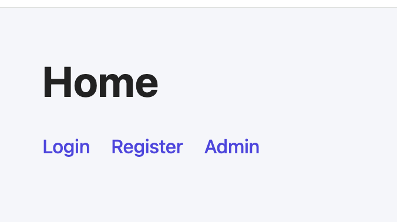
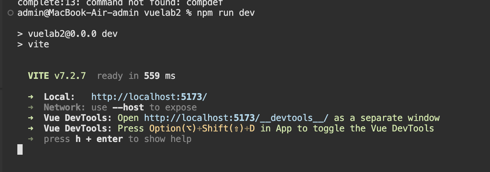
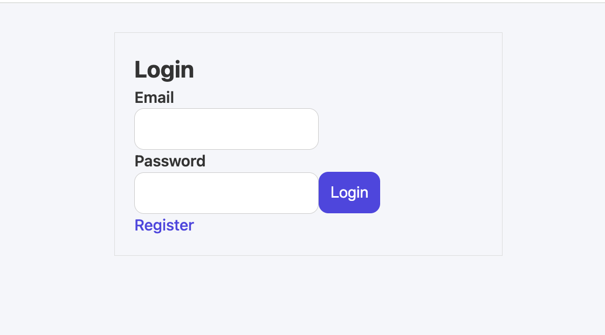
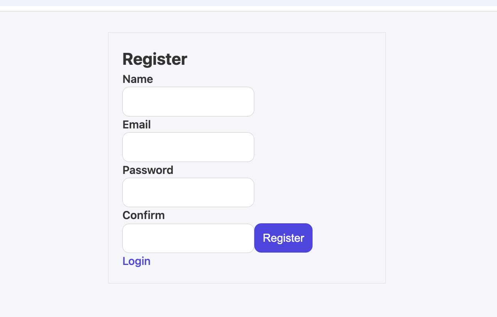
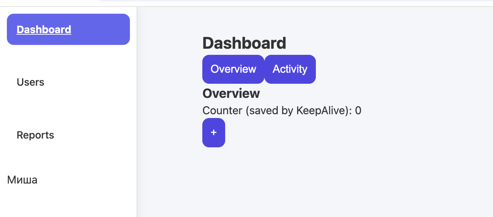
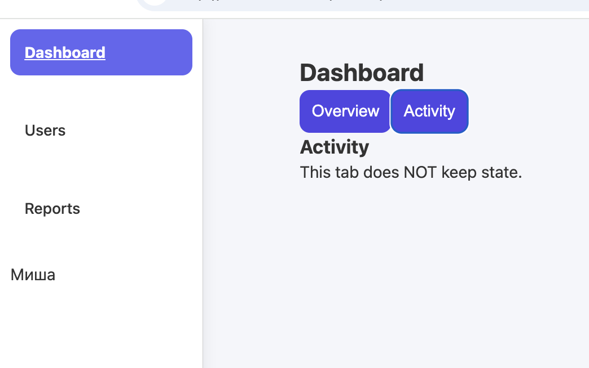
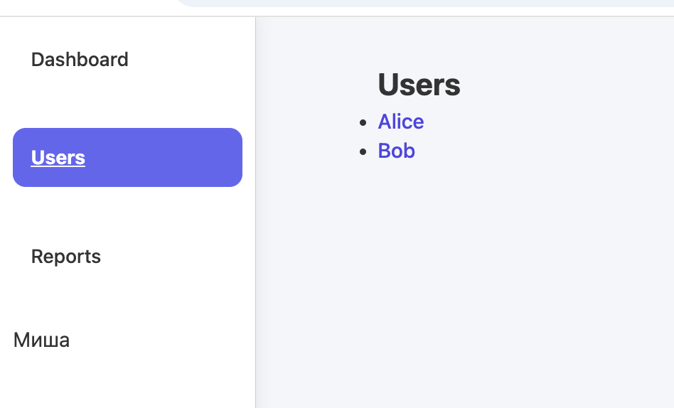
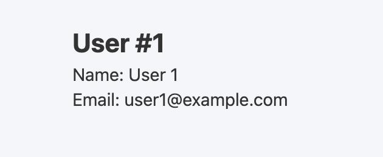
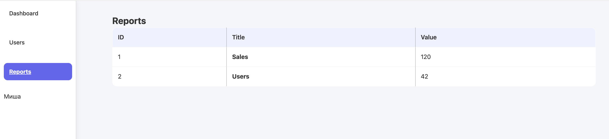

# Лабораторна робота №2  
## Тема: Взаємодія між компонентами та роутинг у Vue.js

### Кроки запуску проєкту

```bash
npm install
npm run dev
Відкрити у браузері:
http://localhost:5173
```
## Props та Emits
### Де застосовано:

Компонент UserCard.vue отримує дані користувача через props
Видалення користувача виконується через подію emit
```bash
<script setup>
defineProps({
  user: Object
})

const emit = defineEmits(["delete"])
</script>
```

## v-model та defineModel

### Де застосовано:

Компонент InputField.vue працює як кастомний інпут
Батьківський компонент керує значенням через v-model
```bash
<script setup>
const model = defineModel()
</script>

<input v-model="model" />
```

## provide / inject

### Де застосовано:

У App.vue створюється контекст авторизації
Navbar.vue та Profile.vue отримують дані через inject
```bash
// App.vue
provide("user", reactive({ isAuth: true, role: "admin" }))

// Navbar.vue
const user = inject("user")
```
## Слоти

### Де застосовано:

Компонент BaseCard.vue має:
слот header
слот default
слот footer

```bash
<div class="card">
  <header><slot name="header" /></header>
  <slot />
  <footer><slot name="footer" /></footer>
</div>
```

## KeepAlive

### Де застосовано:

Кешування HomeView та AdminView при перемиканні роутів
```bash
<KeepAlive>
  <router-view name="main" />
</KeepAlive>
```
Роутинг

## Default + Named Views
```bash
{
  path: "/",
  components: {
    default: HomeView,
    toolbar: ToolbarView
  }
}
```
## Lazy-loading (динамічні імпорти)
```bash
const AdminView = () => import("../views/AdminView.vue")
```
## Навігаційні Guard-и

Admin маршрут захищений
```bash
router.beforeEach((to, from, next) => {
  if (to.meta.requiresAdmin && user.role !== "admin") {
    next("/login")
  } else {
    next()
  }
})
```
 # Скріни 









