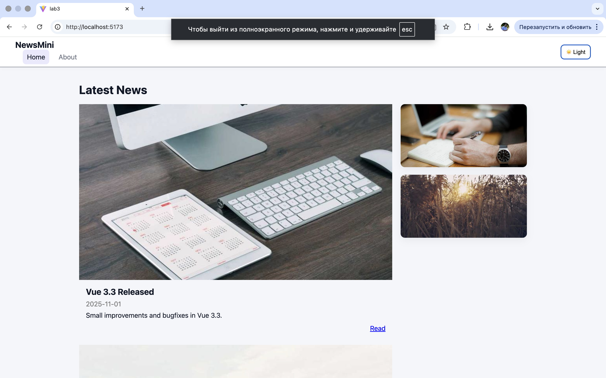
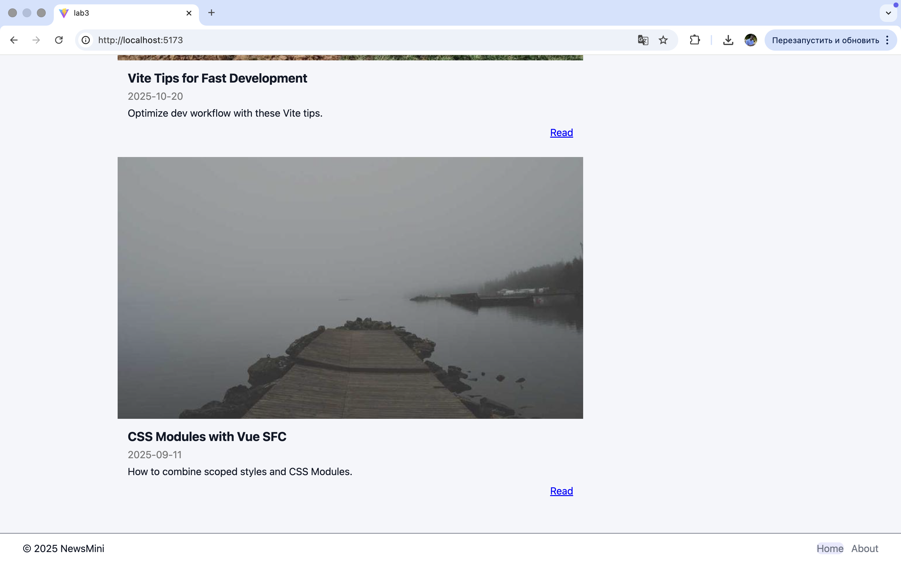
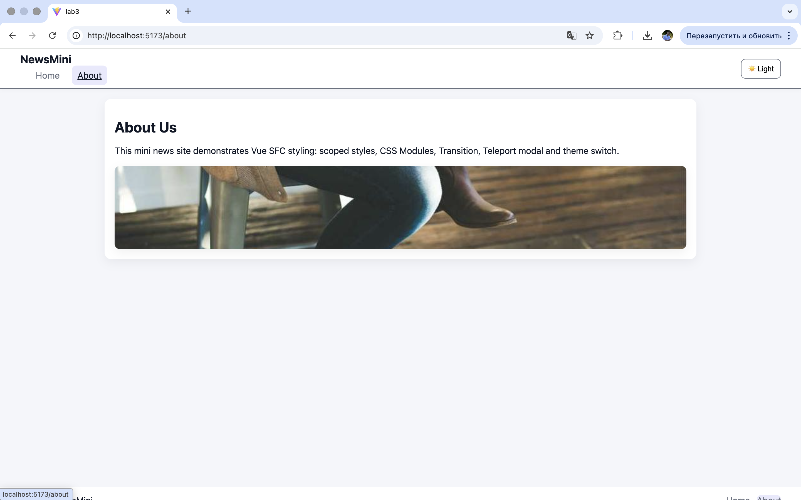

# Лабораторна робота №3
## Тема: Стилізація компонентів у Vue.js

### Кроки запуску проєкту

```bash
npm install
npm run dev
Відкрити у браузері:
http://localhost:5173
```

 # Скріни 






Стилізація у Vue.js має кілька важливих особливостей, які роблять роботу зі стилями більш зручною та структурованою. Основна перевага полягає в тому, що кожен компонент має власну зону відповідальності, включно зі стилями, що допомагає уникати конфліктів і дублювання CSS у великих проєктах.
1. Ізоляція стилів (Scoped CSS)
Vue дозволяє використовувати scoped стилі, які застосовуються лише до певного компонента. Це забезпечує локальність і запобігає випадковому впливу стилів на інші частини застосунку. Завдяки цьому кожен компонент легко підтримувати і розвивати.
2. Підтримка CSS Modules
Vue має вбудовану підтримку CSS Modules, які гарантують унікальність класів і ще більшу ізольованість. Це корисно у великих системах, де важливо уникнути будь-яких перетинів між стилями.
3. Можливість глобальних стилів
Хоча компоненти та їх стилі ізольовані, Vue дозволяє мати глобальні стилі для базового оформлення (типографія, скидання стилів, спільні змінні, теми). Це дає гнучкість у поєднанні локальних і глобальних стилів.
4. Використання CSS-перемінних та data-атрибутів
Для темізації зручно застосовувати CSS-змінні та механізм data-theme. У Vue це реалізується дуже просто: можна змінити атрибут у дереві DOM і автоматично перемикати стилі для темної/світлої теми.
5. Легкість інтеграції з Tailwind, SCSS, постпроцесорами
Vue повністю сумісний зі сторонніми CSS-препроцесорами та фреймворками, і інтеграція працює без додаткових складнощів.