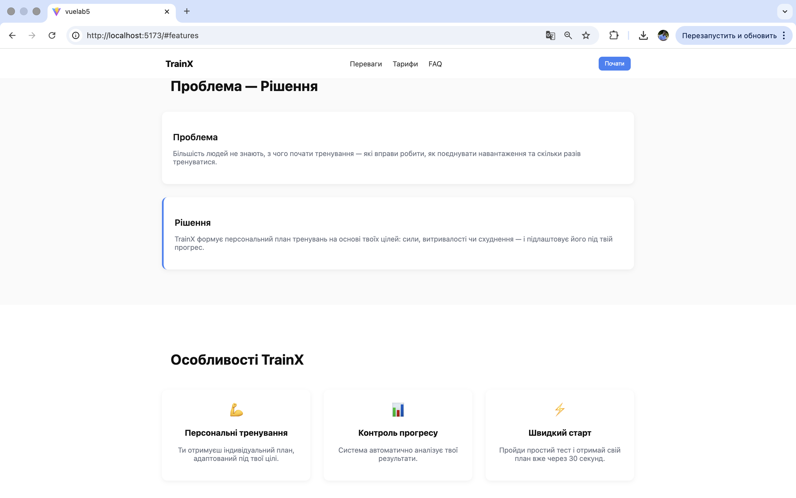
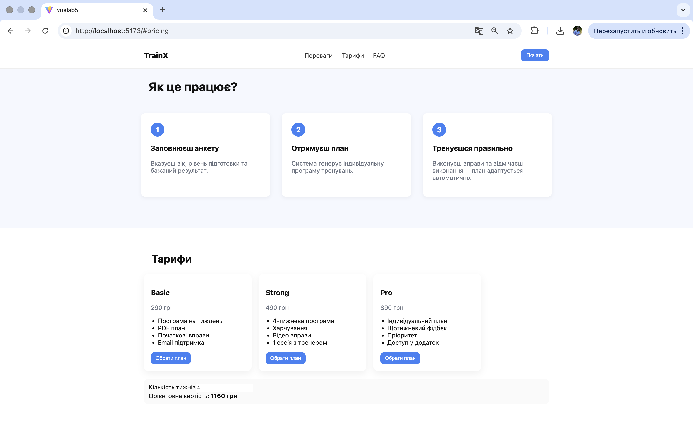
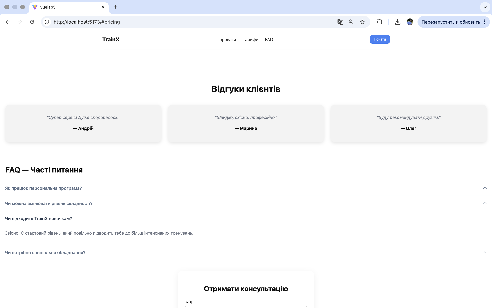
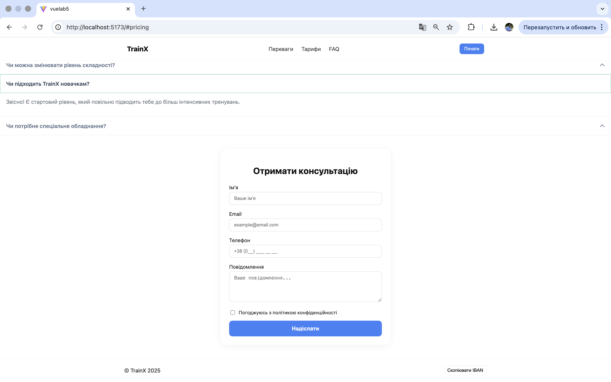

# Лабораторна робота №5
## Тема: Використання інтерфейсних бібліотек (PrimeVue). Створення плагінів у Vue.js
### Кроки запуску проєкту

```bash
npm install
npm run dev
Відкрити у браузері:
http://localhost:5173
```
___
## Структура лендінгу

### У лендінгу реалізовано такі секції:

1. Header — логотип, навігація, кнопка "Почати".

2. Hero — головний заголовок, опис, CTA-кнопки, зображення.

3. Проблема — Рішення — що турбує користувача і як сервіс допомагає.

4. Переваги — карточки з ключовими плюсами програми.

5. Як це працює — покрокове пояснення процесу.

6. Тарифи / Плани — тарифні плани, промокод, CTA.

7. Відгуки — карточки з оцінками клієнтів.

8. FAQ — блок часто поставлених запитань (акордеон).

9. Контактна форма — імʼя, email, телефон, повідомлення, згода.

10. Footer — авторські права, кнопка копіювання IBAN.
___
# Компоненти PrimeVue

У проєкті використано декілька базових компонентів PrimeVue, які забезпечують зручний UI без додаткової ручної стилізації:

### Button: 
-Використовується для кнопок у Hero-секції, формі підписки, CTA-кнопках у тарифах та інших елементах інтерфейсу.

### InputText: 
- Використовується в контактній формі для стандартних текстових полів (ім'я, email).

### InputMask

- Застосовується в полі введення номера телефону в Contact Form.

### Textarea

- Використовується у формі для введення повідомлення (feedback / контакт).

### Checkbox

- Використовується для підтвердження згоди на обробку персональних даних.

### Card

- Застосовується в секціях “Переваги”, “Тарифи”, “Відгуки” для відображення інформаційних блоків у стислому вигляді.

### Accordion / AccordionTab

- Компонент використано в секції FAQ, де кожен елемент є окремим AccordionTab.

### Toast

- Через сервіс ToastService використовується для відображення повідомлення після копіювання промокоду або успішної відправки форми.
___
# Налаштування PrimeVue

Нижче показана базова конфігурація PrimeVue, додана у main.js.
Вона підключає PrimeVue, ToastService, теми та іконки.
```bash
import { createApp } from 'vue'
import PrimeVue from 'primevue/config'
import ToastService from 'primevue/toastservice'
import App from './App.vue'

// Підключення стилів
import 'primevue/resources/themes/aura-light-blue/theme.css'
import 'primevue/resources/primevue.min.css'
import 'primeicons/primeicons.css'

const app = createApp(App)

// Підключення PrimeVue та Toast
app.use(PrimeVue)
app.use(ToastService)

app.mount('#app')
```
Що робить ця конфігурація?
```bash
app.use(PrimeVue) — реєструє всі компоненти PrimeVue у Vue-додатку.
```
```bash
app.use(ToastService) — активує глобальний сервіс сповіщень.
```
Підключені стилі відповідають за вигляд компонентів та іконок.

### CopyToClipboardPlugin — детальний опис

Плагін дозволяє копіювати довільний текст у буфер обміну за допомогою глобального методу $copy.

Реалізація 
```bash
(src/plugins/CopyToClipboardPlugin.js):
export default {
  install(app) {
    app.config.globalProperties.$copy = (text) => {
      navigator.clipboard.writeText(text)
    }
  }
}
```

### Як підключено плагін (у main.js):
import CopyToClipboardPlugin from './plugins/CopyToClipboardPlugin'

app.use(CopyToClipboardPlugin)

### Де використовується у проєкті
1. Hero-секція — кнопка “Скопіювати промокод”
```bash
<Button label="Скопіювати промокод" @click="$copy('FIT2024')" />
```

При натисканні у буфер копіюється промокод.

2. Тарифні плани (опціонально)
```bash
Застосовується для копіювання ID тарифу або промокоду у відповідній картці.
```

3. Toast повідомлення після копіювання
```bash
toast.add({ severity: 'success', summary: 'Скопійовано!', life: 2000 })
```

 # Скріни 





