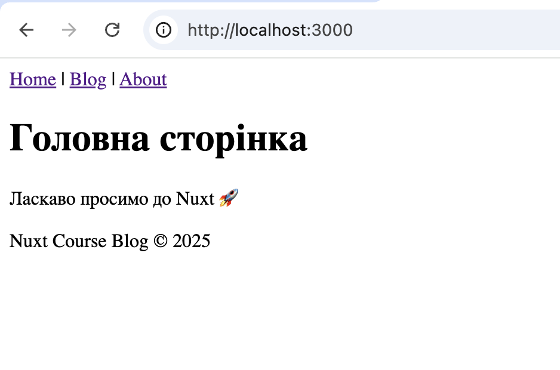
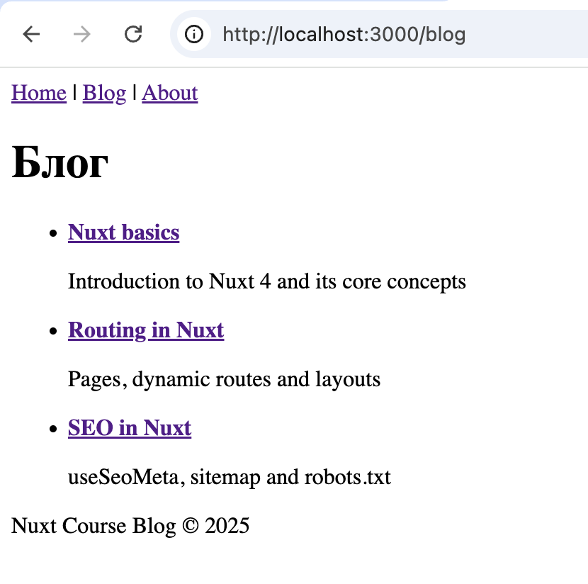
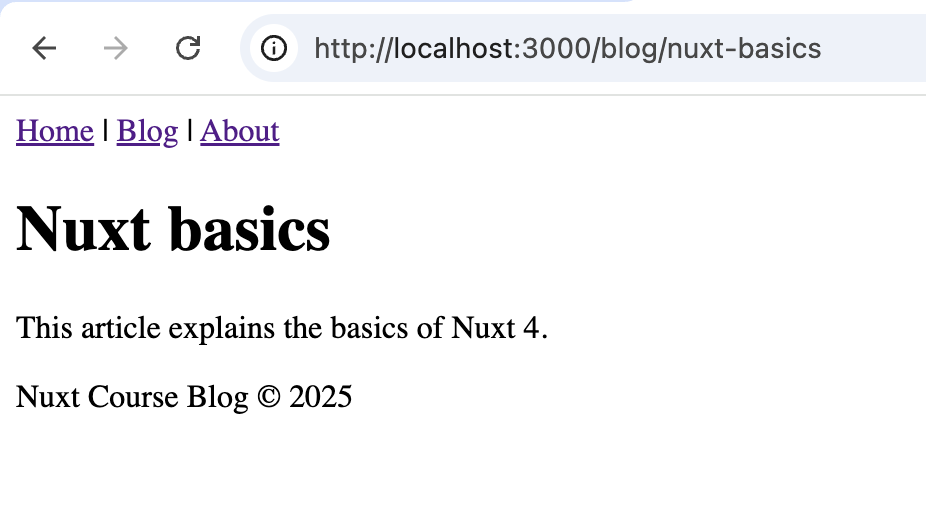
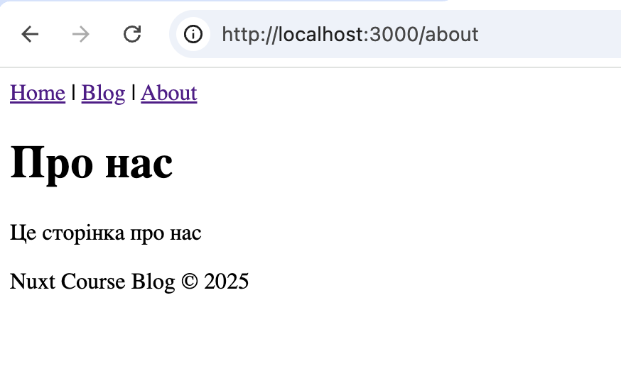
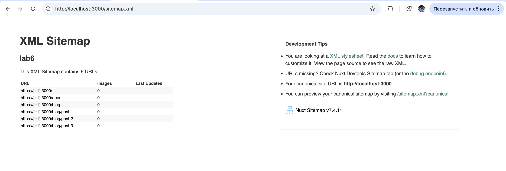

# Лабораторна робота №6

**Тема:** Nuxt.js 4 та Nuxt UI

##  Опис проєкту

Проєкт **"Nuxt Course Blog"** — простий багатосторінковий сайт на Nuxt 4 з блогом, серверними API-роутами, SEO та UI-компонентами Nuxt UI.

---

##  Запуск проєкту

1. Встановити залежності:

```bash
npm install
```

2. Запустити проєкт у режимі розробки:

```bash
npm run dev
```

3. Відкрити в браузері:

```
http://localhost:3000
```

---

## Сторінки проєкту

* `/` — головна сторінка
* `/blog` — список статей
* `/blog/[slug]` — детальна сторінка статті (динамічний маршрут)
* `/about` — сторінка «Про курс»

**Скріншоти сторінок:**

* Головна сторінка (`/`)
* Список статей (`/blog`)
* Детальна стаття (`/blog/[slug]`)
* Сторінка «Про курс» (`/about`)

---

##  useFetch та робота з API
### useFetch використовується:

* **Список статей** (`/blog`):

  * Файл: `app/pages/blog/index.vue`
  * Запит:

  ```js
  useFetch('/api/posts')
  ```

* **Одна стаття** (`/blog/[slug]`):

  * Файл: `app/pages/blog/[slug].vue`
  * Запит:

  ```js
  useFetch(() => '/api/posts/' + route.params.slug)
  ```

### API-роути розташовані:

* `server/api/posts.get.ts` — повертає масив статей
* `server/api/posts/[slug].get.ts` — повертає одну статтю за slug

У файлах використовується `defineEventHandler` та `event.context.params`.

---

## 🔍 SEO-налаштування

Для SEO використовується `useSeoMeta`.

### Налаштовано на сторінках:

* `/` — `app/pages/index.vue`
* `/blog` — `app/pages/blog/index.vue`
* `/blog/[slug]` — `app/pages/blog/[slug].vue`
* `/about` — `app/pages/about.vue`

### Приклад:

```js
useSeoMeta({
  title: 'Blog',
  description: 'Список статей курсу',
  ogTitle: 'Nuxt Blog',
  ogDescription: 'Навчальний блог на Nuxt'
})
```

SEO-теги можна перевірити через **DevTools → вкладка Elements / Head**.

---

## Sitemap та Robots

### Sitemap

* Модуль: `@nuxtjs/sitemap`
* Адреса:

```
http://localhost:3000/sitemap.xml
```

* Індексуються сторінки:

  * `/`
  * `/about`
  * `/blog`
  * `/blog/[slug]`

### Robots.txt

* Файл: `public/robots.txt`
* Адреса:

```
http://localhost:3000/robots.txt
```

* Налаштування:

  * Дозволена індексація основних сторінок
  * Можливе блокування службових маршрутів (наприклад `/api/*`)

---

##  Nuxt UI

У проєкті використані компоненти **Nuxt UI**:

* `UContainer` — обгортка сторінок
* `UCard` — відображення статей
* `UButton` — кнопки навігації
* `UBadge` — додаткові позначки

### Використання:

* Сторінка списку статей: `app/pages/blog/index.vue`
* Детальна сторінка статті: `app/pages/blog/[slug].vue`

---

## Висновок

У ході лабораторної роботи було створено Nuxt 4-проєкт з багатосторінковою структурою, серверними API, SEO, sitemap, robots.txt та UI-компонентами. Усі вимоги лабораторної роботи виконані.

 # Скріни






